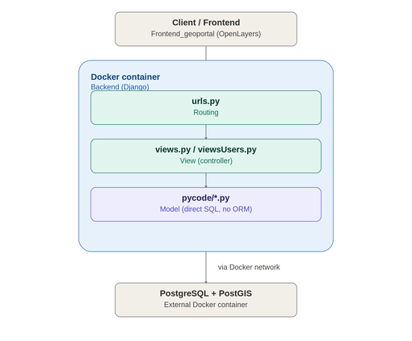

# ![REST](https://img.shields.io/badge/rest-40AEF0?style=for-the-badge&logo=data%3Aimage%2Fpng%3Bbase64%2CiVBORw0KGgoAAAANSUhEUgAAAGQAAABkCAYAAABw4pVUAAAACXBIWXMAAAsTAAALEwEAmpwYAAAIn0lEQVR4nO2dWYwWRRDHR1RExQsRIkjEDUaNEhEVNOFBxYsHIpcYV5EX0fVKvBDRiC8eD95ooqIPSjiMSjTCg2iiRgUExESFNVE5ohiNCBqFXRHYn2m2Nxlqe47u6dnvm%2Fnmn%2BwD7M6%2Fqqtm%2Bqiurg6CChUqVKhQocQApgJrgHbs0a6fnVLrdpQCwD34w521bk%2BhARzv%2BFVEQXH1q3W7CgtgOv4xvdbtKiyAF4QxH3XgeExwPJ%2BPtg0AYJUw5iQHjsmCY2U%2B2pYcwMHALmHMkx14hgoOxXlIPlqXGMBIYchtGbi2Ca6RfrUtKYDDgPHAfMPX8X4G3uWC619gKXADcITfVpQAwJnAq8CfROOxDPxyYA9DyXwFOCNodADDgTeBfcRjn%2FpyMsgZn1LGG8BZQaMBOBVYAnTEGOgPYAFwLdDfg8z%2Bmktxbk9wzNvAsKBBZk4zgbYIY%2BwF3gEmAL1z1KO3lvGulmmC0vFepXNQ4u5pbUTj1QD%2BLHBKDfRqAp4zTCK6oAKTw4MyAbgZ%2BM%2FQ2D3AS8CgOtBxMPCy1kliNzAjqHcAF%2Bpo7AzTLEV3UU9HvHlqFX52UGcARgBfROj8lKkLU20HbgLuAy6qhdK99aAs8TXwgO4G%2Buq5vultU07sFdQpgF5aR6WrxHu6bU26rarNEmrdc2RPKvwiyTDNZDYC5wYFAXCu1jlN2yQW96SSSXN6Ez4HBgQFA9AP%2BAg3XJ63cgcZIrCtwAcRg2EX1ILr0KCgoLOLVgvYKKip84faFmF8k%2Bu0GZgmBKqF3ZjQwmuGwTmvlWEuT%2BcE5XXhBPXltAAn6L8ZY1jstuSlkBrIfknTT2rnKEWfKIMzhFNUm24HBgYGKJsIG%2F0OHBv4hiFA1%2BayP1F2ACcBO4WtnvYtpMmQbPCQVyElAjBH2Eotik%2FzKUDFl8L4qdpHiAZwOLBZ2GxZ4APAJXTH1V7Iy5%2FcJ3Glj0FMTd3C%2BExNf71pXmIAHwvbtWaa%2FuvZRBj7irTSrjVUrM4Q3r8jyzRXhghe8q51yUFnNDuM7U5xLuB6w97z%2FgVQhfRQNjPkCjS7ED0oSBZZk1TYD2U7YcvZgYcwicIz9Rw29wU18PqYuOgwvrIZPr6Qo4GtBrK3gD5ZlQ2leW7TPxMdnk0TBt%2BpA6K3xe3T6y5ahTkkNgHjHNrWR9tK4mfgKFu%2BLtJREblSn2ZN69dvocos6cLvNlNC4FfssQ44MUKXqMQLha0OIXtlIwlly%2FNtuKKSE0xfSmuWpARgrIFzrMXzrvhSOl5nTO7y4RBlE0MYfj%2BHt2QJYAiw3iDEObUfmGvgm2vxfBbcYuBrBn7L2mUpmxg4lO2G2NgnjaDjgO%2BFIOdze8AWg%2BJbLJ4%2FAAnZJEvTHklIyxvz%2FBRBoWx2nC1PWmHh%2FeUO13WJzuyIwoiUHKkNp0PiYfztgzfi%2BQFik2qjLYfNQBUWtN5jeDqMOSk5rAyX9u%2BzOkRzfBei6MjlXCNwhdB1fgaur2Icsq4EDlkoaC5z4UkSonKQwpiZYYIQ%2FtI6DP8eUnCH3C9o7nfhSRIi94qvcuRRC7QwvjJ8MbcV3CETBc1CF54kISt9HAvTWSlhqPHkYfF%2FywvukPMFzWcuPElC1LZtGCc6cBxjSM88R%2F%2BEof7mmASuA5BCdqq%2Ft%2BWNmWo7TedthPwlhBztwHGNVFQn3x1kWJdck8BVl9Pe0IsXxg4XniQh8jjBoR5mH8%2FHrHAXJnClMpx2xrKeWhiGYmNh7HbhydUhWkkZqLw09PtLxe%2F%2BjJNBNrSUwSGZuixDMPEAg0c4bGwMnyvW2Djapo093WXJQX1QxmDiohQ7a3Nj%2BFywNmkyUqRBfYUQcp7l84mDNoZBP4YvLf7Rurek6WaLNO2Vb%2B8ET8HEJIzIy3BFXxjOFkJmWTwrF342mFNAhzjbykbIZULIAk%2FBxCSsK6BDFkXNJvMMv29wDCbaosMUbKxzh%2BQffteCfhSCBjiko7ZaNsgYbEQgS7ty3qD6wZduXrZwDaWRHk%2FxzONJwcY6dkj%2BW7hZkhwM6TWjUzwzWjzTlrdDfOVl5Z7kkDUNyPBcYkYgncHGWIP7dIjPvKxc04B8JMrpN6wLmyxkb4p7zpU3Qpa3vKzcEuV8pZKqz13zbLX89MfFPefKGyPPS15WilTSrU6ppIbjCA2TbO0LMcnW17mQVccR6uw4QnVgp84O7FRH2urpSJsmu0OQVYc%2BLaCj3PLQ561ZCA8BvjWUWaqORacA8Imw3YbMZc4jznFMzUTaAKD7Zpu%2F%2BlmGrI2qtIZ9aY0lgS%2BoosK6Xrp1lnojgu4bcv96L8xsqC5alWdKX57pkcA3VBEuQzQ0qoDZQL0PUtYCZi1R5c8NSemq6FvfvBRSikSV%2BDtB%2F%2F4jMdUra4m%2FPTpxfEaXcyJK%2FE3LWylZHahVF4CMqqGOLiCZWy33vKGjwapAfxS6nCPD7qtyXyIAF%2BOGopaJPd5QZikN1CJ6VE8pKftJE7ZHhLKtEuxqCZ3wtjll2yRe7ElFjzTslZtKjauy3BjOfsys5zA%2BnV3zrIgLBNKUGq9NF60Kz%2Bs7NuKK8asC9iasTnsEuiehDw%2BphGwTnowpxq9scDdwQVDv0MrujhgM1RURg%2Btk%2FTAv5rqKG4MyQd3tpL8KE9r0pSpNNdBrmL5RNOrO3dWlvZdKd2H3xCQU7NXXEE3M%2BcojNY2dpMeDqIsFdmldC7%2BGSvtWvpVwy8J2fQSu2eOlYM16O3VHjNx9WrfyXwoW0Y0trqNr8xaXtnuygZ6lzEt4c%2FO6WHKHnlic7rdV5b96dXkGXlmsoLp61cGII4URq8uJ62BGtlM4ZagDj8q1DaO6vttjfZXJHo4HrHBWqNFB99R%2B64HdcNYkdV3HCgLAdPxjupRTwW4vot2jM9pzO%2B%2FXKADu8uiQO2vdnlKAzoF5tePX0qbvtnUuaVuhQoUKFSoEBcD%2FXUq53%2FegDjAAAAAASUVORK5CYII%3D&logoColor=white) Backend Geoportal
**Backend Geoportal** is an experiemntal REST API for a Web GIS platform, built with [Django](https://www.djangoproject.com/). It exposes endpoints to query and manage geospatial entities, with session-based user authentication protecting write operations. The project is fully **dockerized**, with separate configurations for development and production environments.

The `spatial ORM` provided by the `GeoDjango` module is not used. Instead, explicit SQL/PostGIS statements are used on an experimental basis.


---



---

## 📑 Table of contents

- [Features](#-features)
- [Project structure](#-project-structure)
- [Build and installation](#️-build-and-installation)
- [Environment variables](#-environment-variables)
- [Technologies used](#-technologies-used)
- [Notes](#-notes)

---

## 🚀 Features

- 🌐 REST API ready to be consumed by a web or mobile frontend (CORS enabled)
- 📍 Management of the geoportal's geospatial entities (query, create, update, and delete)
- 🔐 Session-based user authentication, with protected endpoints for write operations
- 🐳 Deployment via Docker / Docker Compose, with separate profiles for development and production
- ⚙️ Configuration based on environment variables, with no credentials hardcoded in the code

---

## 📁 Project structure

```
Backend_Geoportal/
│
├── docker-compose.yml          # Orchestration for the development environment
├── docker-compose.prod.yml     # Orchestration for the production environment
├── scripts/ (*.sh)             # Helper scripts for database management
│
└── juavaal2/                   # Django project
    ├── manage.py
    ├── requirements.txt
    ├── Dockerfile
    │
    ├── juavaal2/                # Project configuration (settings, urls, wsgi/asgi)
    └── appjuavaal2/             # Main API application (views, routes, models, and business logic)
```

---

## ⚙️ Build and installation

### With Docker (recommended)

```bash
git clone https://github.com/jrvalza/Backend_Geoportal.git
cd Backend_Geoportal
```

Development (with hot reload):

```bash
docker compose -f docker-compose.yml up --build
```

Production:

```bash
docker compose -f docker-compose.prod.yml up --build -d
```

The API will be available at `http://localhost:8000/`

---

## 🔧 Environment variables

The project reads its configuration from `.env` / `.env.dev` / `.env.prod` files (not included in the repository), containing values such as the database connection, `DEBUG` mode, and the ports exposed by each environment.

---

## 🧠 Technologies used

| Technology | Purpose |
|---|---|
|  | Main language |
|  | Web framework, routing, authentication, and sessions |
|  | Packaging and service orchestration |
|  | Database |
|  | WSGI server in production |

---

## 📌 Notes

- The REST API is designed to work as a standalone service, consumed by a web frontend.
- The separate configuration between `docker-compose.yml` and `docker-compose.prod.yml` keeps the development workflow agile without affecting production deployment.
- Access to geospatial data is currently based on pure SQL with `PostGIS` statements, rather than using the spatial ORM provided by `GeoDjango`. Migrating or adapting data access to use the GeoDjango module is the next planned step.
- Some settings (CSRF middleware disabled, permissive CORS/ALLOWED_HOSTS, limited exception handling) are relaxed for local/experimental use and should be hardened before any public deployment.
